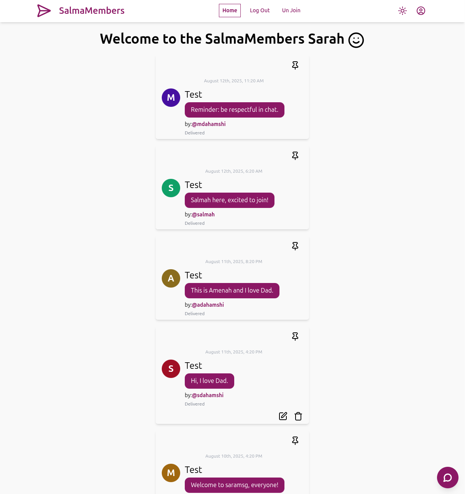
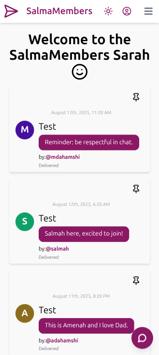

# SalmaMembers

SalmaMembers is a self-hosted,exposed by cloudflare tunnel, full-stack messaging and member management application.  
It features a clean UI, user authentication, editable messages, pinned posts, and responsive design — all built with React, Flowbite, and a REST API backend.

---

## ✨ Features

- **User Authentication** – Login, signup, and member role checks.
- **Message Board** – Post, edit, and delete messages in real time.
- **Pinned Messages** – Highlight important announcements at the top.
- **Inline Editing** – Edit messages directly inside the conversation list.
- **Responsive UI** – Mobile-friendly chat bubble design.
- **Date Formatting** – Friendly timestamps via `date-fns`.
- **Self-Hosted** – Runs on your own server (tested with Proxmox + Coolify + Cloudflare Tunnel).

---

## 📸 Screenshots




---

## 🛠 Tech Stack

**Frontend**
- [React](https://reactjs.org/)
- [Flowbite React](https://flowbite-react.com/) (Tailwind-based UI components)
- [Lucide React](https://lucide.dev/) (icons)
- [React Router](https://reactrouter.com/) (routing)
- [date-fns](https://date-fns.org/) (date formatting)

**Backend**
- REST API (compatible with CRUD operations in `useCrud` hook)
- PostgreSQL (example seed data included)
- Node.js / Express (example API layer)
- exposed by cloudflare tunnel
- coolify
- proxmox
---

## 📦 Installation

```bash
# Clone repository
git clone https://github.com/mdahamshi/top-members.git
cd top-members

# Install dependencies
npm install

# Start development server
npm run dev
