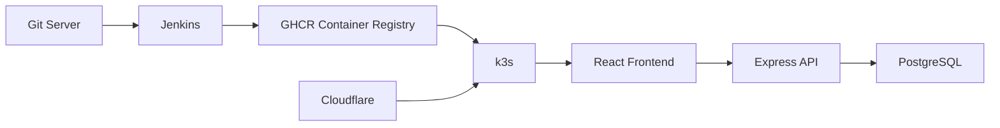
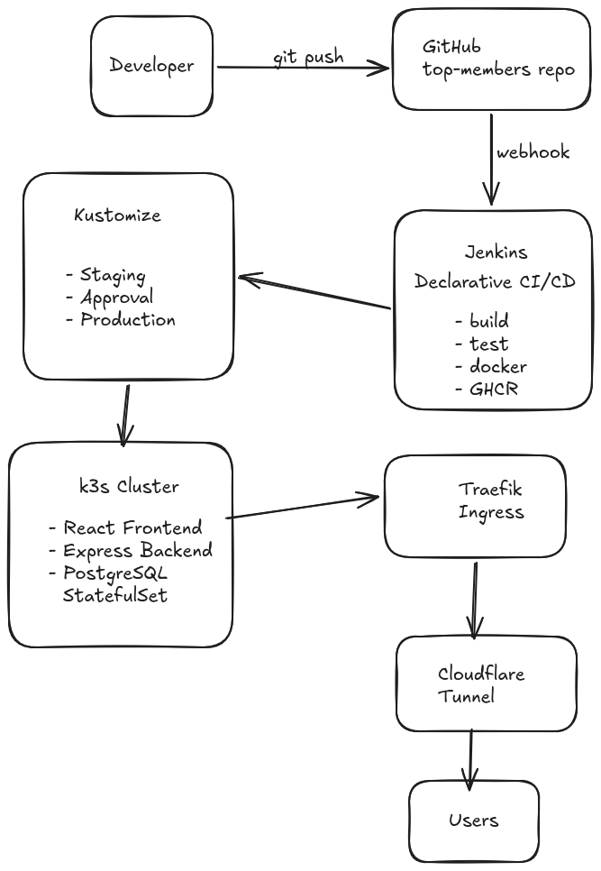
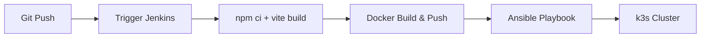
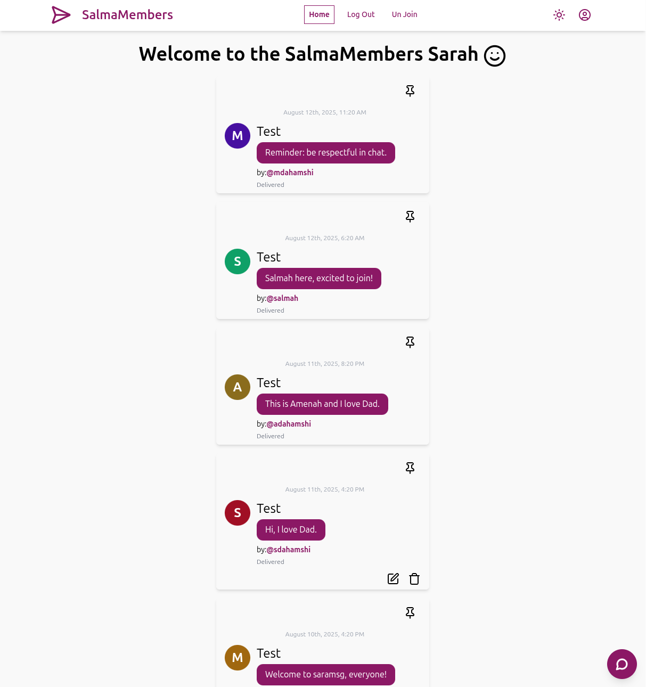
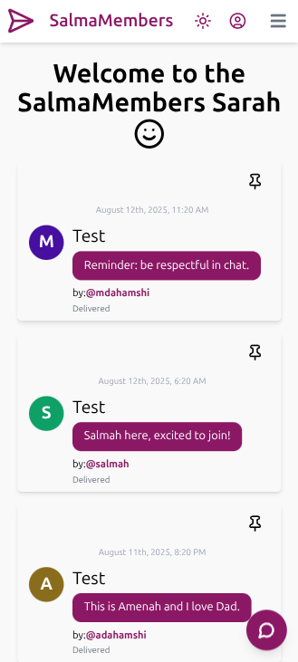
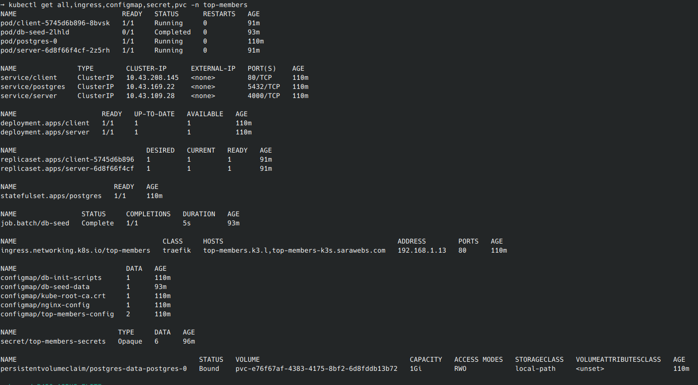
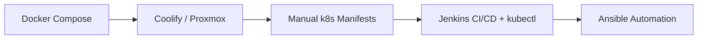

# Top Members

A full-stack messaging and member management application deployed to k3s Kubernetes via Ansible, with Jenkins CI/CD.

> 🟢 **Live Demo - K3S:** https://top-members-k3s.sarawebs.com/
## Architecture Diagram


```mermaid
flowchart LR
    GitHub[Git Server] --> Jenkins
    Jenkins --> GHCR[GHCR Container Registry]
    GHCR --> k3s
    k3s --> Client[React Frontend]
    Client --> Server[Express API]
    Server --> PostgreSQL
    Cloudflare --> k3s
```


## Tech Stack

| Layer | Technology |
|---|---|
| **Frontend** | React 19, Flowbite React, Vite, Tailwind CSS |
| **Backend** | Node.js, Express, Passport.js |
| **Database** | PostgreSQL 15 |
| **Container** | Docker, multi-stage builds |
| **Orchestration** | k3s Kubernetes |
| **CI/CD** | Jenkins Declarative Pipeline |
| **Deployment** | Ansible |
| **Registry** | GitHub Container Registry (GHCR) |
| **Ingress** | Traefik (k3s built-in) |
| **Infrastructure** | Proxmox → k3s → Cloudflare Tunnel |

## Project Structure

```
├── client/              # React frontend
│   ├── Dockerfile
│   └── nginx.conf
├── server/              # Express API backend
│   ├── Dockerfile
│   └── src/
├── k8s/                 # Kustomize manifests (managed by Ansible)
│   ├── base/
│   ├── staging/
│   └── prod/
├── Jenkinsfile           # CI/CD pipeline
├── Dockerfile            # Custom Jenkins image with Ansible + kubectl
└── docs/                # Documentation
```

## Deployment Flow


```mermaid
flowchart LR
    Push[Git Push] --> Jenkins[Trigger Jenkins]
    Jenkins --> Build[npm ci + vite build]
    Build --> Docker[Docker Build & Push]
    Docker --> Ansible[Ansible Playbook]
    Ansible --> K8s[k3s Cluster]
```

## Quick Start (Development)

```bash
git clone https://github.com/mdahamshi/top-members.git
cd top-members
npm install
npm run dev
```

## Deployment

See [docs/deployment.md](docs/deployment.md) for Kubernetes deployment guide.  
See [docs/ci-cd.md](docs/ci-cd.md) for Jenkins pipeline setup.

## Screenshots







## Migration Journey


```mermaid
flowchart LR
    Compose[Docker Compose] --> Coolify[Coolify / Proxmox]
    Coolify --> K8s[Manual k8s Manifests]
    K8s --> Jenkins[Jenkins CI/CD + kubectl]
    Jenkins --> Ansible[Ansible Automation]
```

## Lessons Learned

- Kustomize overlays simplify environment management (staging vs prod)
- StatefulSets for databases require careful PVC planning
- Ansible provides a cleaner, reusable deployment layer on top of k8s manifests
- Custom Jenkins Docker image bundles both Ansible and kubectl for pipeline execution
- Cloudflare Tunnel + k3s Traefik works seamlessly for private clusters
