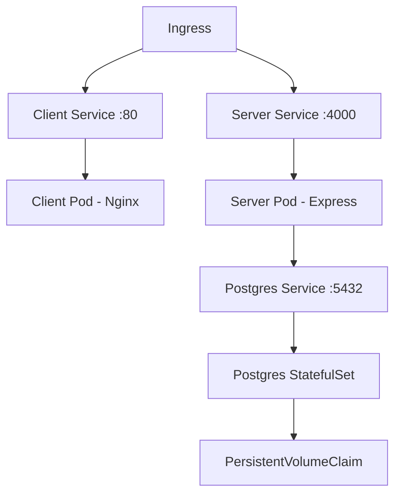

# Architecture

## System Overview

Top Members runs on a single-node k3s cluster with three main services:

```
Internet → Cloudflare Tunnel → k3s Node → Traefik Ingress
                                              ├── /api/* → server:4000
                                              └── /*      → client:80
```

## Components

### Client (React SPA)

- Built with Vite, served by Nginx
- Static files only — no server-side rendering
- Ingress routes `/api/*` directly to the server service

### Server (Express API)

- REST API at `/api/v1/*`
- Session-based auth with Passport.js + PostgreSQL session store
- Three-tier access: public, members, admin

### PostgreSQL

- StatefulSet with PersistentVolumeClaim (1Gi)
- Schema + init scripts applied via ConfigMap at first startup
- Seed data applied separately via a one-shot Job

## Kubernetes Resources



## Networking

| Service | Type | Port | Protocol |
|---|---|---|---|
| Client | ClusterIP | 80 | HTTP |
| Server | ClusterIP | 4000 | HTTP |
| Postgres | ClusterIP | 5432 | TCP |

## Security

- Ingress handles TLS termination (via Traefik)
- Secrets stored as k8s Secrets (not in git)
- Session secrets, DB credentials, and app passcode are injected at deploy time
