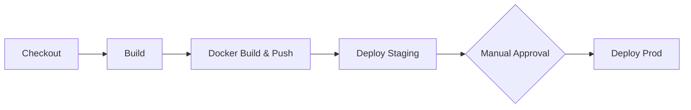

# CI/CD Pipeline

## Overview

The Jenkins Declarative Pipeline (`Jenkinsfile`) automates the entire build, test, and deploy workflow.

## Pipeline Stages



### 1. Build

- Runs `npm ci` to install dependencies
- Runs `npm run build` for the React client (Vite production build)
- Executes inside a `node:20-alpine` Docker container

### 2. Docker Build & Push

- Builds two images: `top-members-client` and `top-members-server`
- Tags with build number + `latest`
- Pushes to `ghcr.io/mdahamshi/`
- Uses `docker.withRegistry` with stored credentials

### 3. Deploy Staging

- Injects the new image tag into `k8s/staging/kustomization.yaml` via `sed`
- Applies manifests with `kubectl apply -k`
- Waits for rollout to complete

### 4. Deploy Prod

- Same as staging but with a manual approval gate
- Deploys to `top-members` namespace

## Jenkins Setup

### Required Credentials

| ID | Type | Purpose |
|---|---|---|
| `github-user-pass` | Username with password | GHCR push (user: mdahamshi, pass: GitHub token) |
| `k3s-kubeconfig` | Secret text | Base64-encoded k3s kubeconfig |

### Required Plugins

- Docker Pipeline
- Credentials Binding

## Kustomize Image Tag Injection

The pipeline uses `sed` to replace the `newTag` in the Kustomize overlay before applying:

```bash
sed -i 's|newTag: ".*"|newTag: "'"$IMAGE_TAG"'"|' k8s/staging/kustomization.yaml
kubectl --kubeconfig=/tmp/k3s-config apply -k k8s/staging
```
