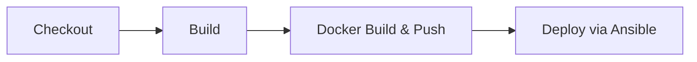

# CI/CD Pipeline

## Overview

The Jenkins Declarative Pipeline (`Jenkinsfile`) automates the entire build, test, and deploy workflow.

## Pipeline Stages



### 1. Build

- Runs `npm ci` to install dependencies
- Runs `npm run build` for the React client (Vite production build)
- Executes inside a `node:20-alpine` Docker container

### 2. Docker Build & Push

- Builds two images: `top-members-client` and `top-members-server`
- Tags with build number + `latest`
- Pushes to `ghcr.io/mdahamshi/`
- Uses `docker.withRegistry` with stored credentials

### 3. Deploy via Ansible

- Clones the [`ansible-homelab`](https://github.com/mdahamshi/ansible-homelab) repository
- Runs `ansible-playbook deploy.yml -e "image_tag=${IMAGE_TAG}"`
- The playbook handles applying k8s manifests and rolling out updates

## Jenkins Setup

### Required Credentials

| ID | Type | Purpose |
|---|---|---|
| `github-user-pass` | Username with password | GHCR push (user: mdahamshi, pass: GitHub token) |

### Custom Jenkins Image

The pipeline requires a Jenkins agent with Ansible and kubectl installed.  
See [`Dockerfile`](../Dockerfile) for the custom image based on `jenkins/jenkins:2.555.2`.

### Required Plugins

- Docker Pipeline

## Ansible Deployment

The pipeline delegates all cluster operations to an Ansible playbook from the external [`ansible-homelab`](https://github.com/mdahamshi/ansible-homelab) repo:

```bash
ansible-playbook deploy.yml -e "image_tag=<build-number>"
```

The playbook handles image tag injection, manifest application, and rollout verification on the k3s cluster.
